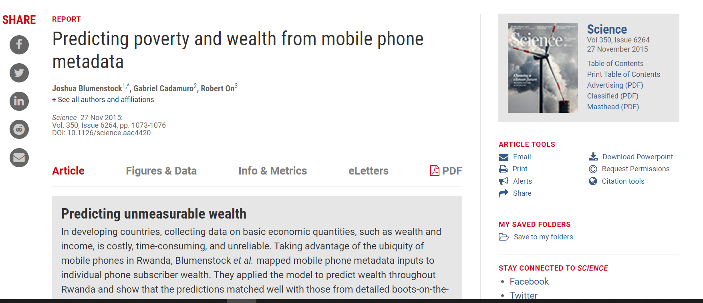
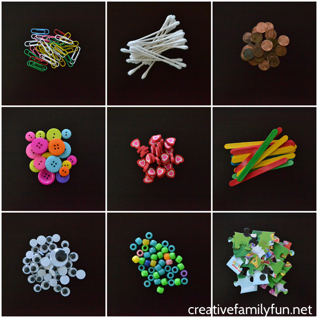

```{r setup, include=FALSE}
knitr::opts_chunk$set(echo = TRUE)
```


## 0. What is Computational Social Science?

[MANIFESTO DA CIÊNCIA SOCIAL COMPUTACIONAL](https://www.uel.br/revistas/uel/index.php/mediacoes/article/view/16806/13378)


## 0. What is Computational Social Science?

>"The new field of Computational Social Science can be defined as the interdisciplinary investigation of the social universe on many scales, ranging from individual actors to the largest groupings, through the medium of computation." (p.2)

CIOFFI-REVILLA, C. Introduction to Computational Social Science: Principles and Applications. [s.l.] Springer, 2017. 


CIOFFI-REVILLA, C. Introduction to Computational Social Science: Principles and Applications. [s.l.] Springer, 2017. 


# 1. Introduction

## 1.1 An ink blot





>"window into the future of social research" (p.2)


## 1.2 Welcome to the digital age

> "the digital age creates new opportunities for social research" (p.2)

## 1.2 Welcome to the digital age

> "when you think about social research in the digital age you should not just think online, you should think everywhere" (p.2)


## 1.2 Welcome to the digital age

> "Apesar de todas as diferenças, ciências sociais computacionais, métodos digitais e big data compartilham uma convicção subjacente: novas fontes de dados e novas técnicas para armazenamento e análise de dados podem levar à próxima mudança de paradigma nas ciências sociais" (JUNGHERR, 2015, p.34) 


## 1.3 Research design

> "links questions and answers" (p.6)

## 1.3 Research design

> "observing behavior, asking questions, running experiments, and collaborating with others"  (p.6)


## 1.4 Themes of this book

> "Repurpose"/"Reaproveitar"


## 1.4 Themes of this book


> "readymade" OR/AND "customade" (blending)


# 2. Observing behavior

## 2.1 Introduction

> In the analog age, collecting data about behavior (...) was expensive, and therefore relatively rare. Now, in the digital age, the behaviors of billions of people are recorded, stored, and analyzable. (p.13)

## 2.1 Introduction


"Digital trace data": 


1. São dados encontrados (mesmo os extraídos), ao invés dados de produzidos para a pesquisa (ad hoc) através de instrumentos de pesquisa;

2. São dados relacionados/baseados em eventos ao invés de dados resumidos ou sintetizados;

3. Como os eventos ocorrem em um período de tempo, são dados dados longitudinais.

[Howison et al. 2011, p. 769](https://www.researchgate.net/publication/325997767_Validity_Issues_in_Linked_Data_Driven_IS_Research)

## 2.1 Introduction

> "big data is observational data" (p.13)
 
 
## 2.2 Big Data


> 3, 5 or 7 "Vs"


> 5 Ws: "Who, What, Where, When, and Why" (p.14)

## 2.2 Big Data 

> "which kinds of research questions big data sources have attractive properties and for which kinds of questions they might not be ideal" (p.15)

## 2.2 Big Data 


> "big data is more than online behavior" (p.15)

## 2.2 Big Data 

- Epistemological debate: "Raw data is an oxymoron"

- Dataset ideal-típico

- Hybrid is the best! 


# 2.3 Ten common characteristics of big data


## 2.3.1 Big

- "Large datasets are a means to an end; they are not an end in themselves"

## 2.3.1 Big


## 2.3.2 Always-On (Sempre ligado!)

- *travel back in time*

- real-time estimates

- fast response

- (drift!)

## 2.3.3 Nonreactive (Não-reativo!)

- reactivity (Webb et al. 1966): "people can change their behavior when they know that they are being observed by researchers"

## 2.3.3 Nonreactive (Não-reativo!)

> "Digital Data Traces das interações com serviços on-line não permitem inferências sobre os reais interesses dos usuários, mas apenas sobre a fatia de seus interesses que querem que seja visto publicamente" (JUNGHERR, 2015, p.44) 

## 2.3.4 Incomplete

- big data sources are incomplete: demographic information, behavior on other platforms, and data to operationalize theoretical constructs (p.24)

- validity of construct: "match between theoretical constructs and data" (p.25)

- "more data IS NOT a scape" 

- imputation + record linkage

- danger zone: "database of ruin"

## 2.3.5 Inaccessible

- "legal, business, and ethical barriers" (p.27)

- most large companies—are very risk-averse

## 2.3.6 Nonrepresentative

- "within-sample comparisons" and "out-of-sample generalizations"

- generalization -> transportability

- "lots of nonrepresentative data is still non-representative"

- "more within-sample comparisons in many nonrepresentative groups"

## 2.3.7 Drifting

- population (change in who is using them)

- behavioral (change in how people are using them) 

- system (change in the system itself)

## 2.3.8 Algorithmically confounded

- ex: Facebook 20 friends

- big data IS NOT natural behavior!

- ex: People in casino

## 2.3.9 Dirty

- big data = big mess = big trash

- "for" and Bot effect!

- SPAM

## 2.3.10 Sensitive

- "de-identification"


# Conclusion (2.3.3 - 2.3.10):


> "incomplete, inaccessible, nonrepresentative, drifting, algorithmically confounded, inaccessible, dirty, and sensitive—come from the fact that these data were not collected by researchers for researchers" (p.41)

# 2.4 Research strategies

## 2.4.1 Counting things

{width=60%}

## 2.4.1 Counting things

- motivating by absence

- important research -> important decision

- ex: taxi-drivers and China censorship

## 2.4.2 Forecasting and nowcasting

- “predict the present” (Choi and Varian 2012)

- ex: Google Flu 

## 2.4.3 Approximating experiments

- natural experiments: "always-on data source and look for random events in the world" (p.53)

- matching-pruning: "create pairs of people who are similar except that one has received the treatment and one has not" (p.55)

## 2.5 Conclusion

- "no free lunch": in use of data for social scientists

- "empirically driven theorizing"

- "data-first approach, however, does not imply 'the end of theory'"


# Obrigado!